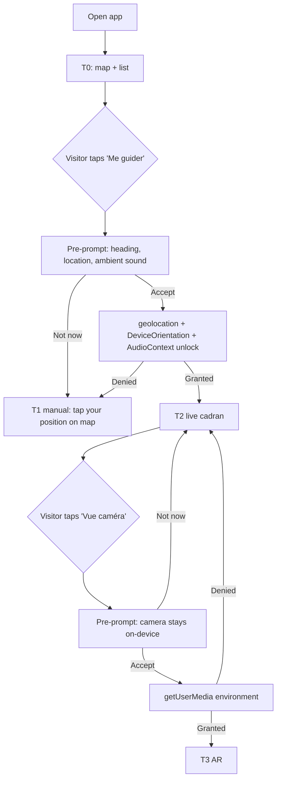
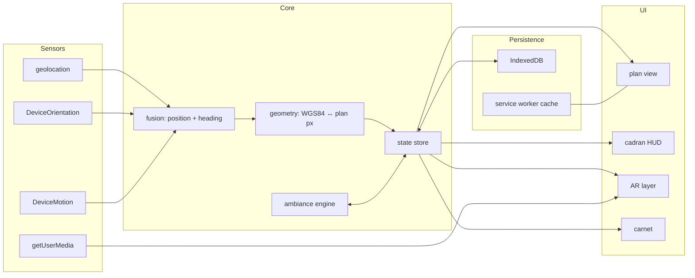

# SDD — boussole

Web mobile AR wayfinding: a gamer-style compass HUD pointing to precise positions inside a large single-level building.

- Status: draft v0.2 — 2026-09-16 (demo scope fixed, ambient content model, debug pose source)
- Licence: AGPL-3.0-or-later, REUSE-compliant
- Target: mobile browsers (iOS Safari 17+, Android Chrome 120+), installable PWA, no native app

---

## 1. Overview

boussole (fr. *compass*) is a local-first progressive web app. A visitor opens a URL (or scans a QR code at the entrance), sees a 2D map of the building with points of interest (**repères**), and a compass HUD that points toward a selected repère with distance and bearing. With location and camera permission, the HUD becomes an AR overlay on the live camera feed. Along the way, curated ambient content (text, images, video loops, audio) surfaces where it belongs in the space, in the spirit of Pokémon Go but as a spatial augmentation of the venue rather than a game to win.

### 1.1 Goals

| ID | Goal |
| --- | --- |
| G1 | Point a visitor to a target within ±3 m on a single floor |
| G2 | Be useful with **zero** permissions granted (map, list, static directions) |
| G3 | Ask for permissions only when the visitor triggers the feature that needs them, with a plain explanation first |
| G4 | Run fully offline after first load: map tiles, repères, assets, carnet state all cached on-device |
| G5 | No account, no server-side tracking, no third-party scripts |
| G6 | Content is data, not code: a venue is a JSON bundle an artist/technician can author without touching the app |
| G7 | Testable without walking: any pose (position + heading) can be injected for debug and demo |

### 1.2 Non-goals (v1)

- Multi-floor / vertical positioning
- Multi-user or realtime sync (leaderboards, shared world)
- Native BLE beacon trilateration (Web Bluetooth is Chrome-only, absent on iOS)
- Full WebXR world tracking (Safari lacks `immersive-ar`); AR layer is heading-based, not SLAM
- Server-side positioning
- Scoring, timers, leaderboards, or any win condition

### 1.3 Vocabulary

| Term | Meaning |
| --- | --- |
| **repère** | A target: named GPS/local position carrying curated content |
| **plan** | The 2D venue map (raster or SVG) with a georeference |
| **ancre** | An anchor: a known physical spot (QR, floor sticker) used to reset position |
| **cadran** | The compass HUD component |
| **parcours** | An ordered set of repères forming a route |
| **carnet** | The visitor's local record of repères encountered |
| **tableau** | An ambient content piece (text, image, video loop, audio) bound to a repère or a zone |

---

## 2. Capability tiers

The app degrades gracefully. Every tier is a complete, non-broken experience.

| Tier | Permissions | What works |
| --- | --- | --- |
| **T0 — Plan** | none | Cached map, repère list, tap a repère → description, photo, text directions ("north wing, past the elevators"), search, carnet (manual check-in via QR scan handled by the camera app, not ours) |
| **T1 — Cadran** | `DeviceOrientation` (iOS prompts; Android silent) | Compass rose rotates with device heading; "you are here" set manually by tapping the map or scanning an ancre QR; bearing and distance to target from that manual position |
| **T2 — Position** | `geolocation` (high accuracy) | Position updates from GPS/Wi-Fi/cell fusion; map recentres; distance/bearing live; dead reckoning between fixes |
| **T3 — AR** | T2 + `camera` | Camera feed behind the cadran; target marker and distance pinned to the horizon at its bearing; discovery radius triggers "capture" animation |

Rules:

- **CAP-1** Tier detection runs on every launch; the UI never shows a dead button. A locked feature shows a small padlock and one sentence about what unlocking gives.
- **CAP-2** Denied permission is remembered (localStorage flag) and never re-prompted automatically. A "Réactiver" entry in settings explains how to re-enable in browser settings.
- **CAP-3** Loss of GPS mid-session drops to T1 with the last known position and a "position estimée" badge, not an error.

---

## 3. Permission flow

Permissions are requested **just-in-time**, behind an explanatory pre-prompt, never on load.



Requirements:

- **PERM-1** Pre-prompt is an in-app sheet with: what is requested, what it enables, that nothing leaves the device, a primary "Continuer" and a secondary "Pas maintenant". Only "Continuer" calls the browser API.
- **PERM-2** iOS 13+ `DeviceOrientationEvent.requestPermission()` must be called from a user gesture; it is chained inside the same tap as geolocation.
- **PERM-3** Camera stream uses `facingMode: { ideal: 'environment' }`, no audio, released (`track.stop()`) as soon as the visitor leaves the AR view or the tab loses visibility.
- **PERM-4** Geolocation `watchPosition` is stopped when the tab is hidden for more than 60 s and resumed on `visibilitychange`.
- **PERM-5** All permission states are exposed in a settings screen with the current tier and per-permission status (`navigator.permissions.query` where supported).
- **PERM-6** The QR code at the entrance encodes the venue URL plus the nearest ancre id, so a T0 visitor already has a plausible starting position.
- **PERM-7** Audio playback is unlocked in the **same user gesture** as the location/orientation request ("Me guider" tap): create the `AudioContext`, `resume()` it, and play a one-sample silent buffer. iOS and Chrome treat this as the autoplay grant for the session. The pre-prompt sheet lists "son ambiant" alongside location and heading. Video loops are `muted playsinline autoplay` and never depend on this grant; their audio track, if any, routes through the unlocked `AudioContext`.
- **PERM-8** Audio state (`unlocked: boolean`) is part of the tier detection; if the gesture was lost (page reload), any tap on the plan re-unlocks silently.

---

## 4. Architecture

Single-page Svelte 5 PWA. No backend required at runtime; a static host (or a Pi on the venue LAN) serves the bundle.



Modules (`src/lib/`):

| Module | Responsibility |
| --- | --- |
| `sensors/` | Thin adapters, one per browser API, each exposing a Svelte `readable` store and a `start()/stop()` pair. Feature-detects; never throws to UI. |
| `fusion/` | Merges GPS fixes, heading, step events and ancre resets into a single `Pose { lat, lon, heading, accuracy, source }` at ≥10 Hz |
| `geometry/` | Georeference: affine transform between WGS84 and plan pixel space; haversine distance; bearing; local ENU tangent plane for sub-metre math |
| `plan/` | Renders the plan (raster via `<canvas>`, or SVG) with pan/zoom, repère markers, visitor dot with accuracy circle |
| `cadran/` | Compass HUD, target arrow, distance, "hot/cold" ring |
| `ar/` | Camera `<video>` + overlay `<canvas>`; projects targets by bearing delta and pitch |
| `ambiance/` | Tableau triggers (approche, arrivée, regard, zone), media scheduling and crossfades, parcours progression; pure functions over state |
| `debug/` | `SimPositionSource`, trace playback, readout panel (§12.1) |
| `content/` | Loads and validates the venue bundle (JSON schema); provides repères, ancres, plan |
| `store/` | Persistent state in IndexedDB via `idb-keyval`; atomic writes (write new key, then swap pointer) |
| `i18n/` | fr-CA default, en fallback |

Design rules:

- **ARCH-1** Sensor adapters are the only place browser APIs are touched; everything else is testable in Node with recorded sensor traces (`fixtures/traces/*.jsonl`).
- **ARCH-2** Fusion is a pluggable registry: `PositionSource` trait-like interface (`{ id, priority, start, stop, subscribe }`); GPS, manual, ancre-QR and dead-reckoning are four implementations. Adding BLE later is one more file.
- **ARCH-3** The venue bundle is loaded once and cached by the service worker with a content hash in its URL; the app shell is `precache`, the bundle is `stale-while-revalidate`.
- **ARCH-4** No runtime network call is required after install. Optional "check for updates" is a manual action.

---

## 5. Positioning strategy (indoor, single level)

GPS indoors is typically 10–50 m error or absent. The strategy is *good enough, honest about uncertainty, cheap to correct*.

| Source | Accuracy | Availability | Role |
| --- | --- | --- | --- |
| GPS/Wi-Fi fusion (`watchPosition`) | 5–50 m indoor | T2 | Coarse position, drift correction over time |
| Ancre QR scan | < 1 m | T0+ (camera app) or T3 (in-app scan) | Hard reset of position; primary precision source |
| Manual tap on plan | 2–5 m | T1 | Fallback reset |
| Dead reckoning (step detection + heading) | drift ~5 %/distance | T1 with `DeviceMotion` | Fills gaps between fixes for smooth cadran |
| Proximity to repère (self-report "Je suis arrivé") | n/a | all | Game confirmation, also a soft position reset |

Fusion rules:

- **POS-1** Pose = weighted blend; an ancre or manual reset sets position with `accuracy` 1 m and zeroes DR drift. GPS fixes with `accuracy > 30 m` are used only to bound drift, not to move the dot.
- **POS-2** Heading: `deviceorientationabsolute` when available (Android); on iOS use `webkitCompassHeading`. Apply screen-orientation offset. Smooth with a circular exponential moving average, α = 0.2.
- **POS-3** Step detection: DeviceMotion accel magnitude, band-pass 1–3 Hz, peak threshold adaptive; stride length default 0.7 m, configurable per venue.
- **POS-4** Accuracy is always shown (circle on plan, ring on cadran). When accuracy > 15 m the cadran arrow is dimmed and the app suggests the nearest ancre.
- **POS-5** Magnetic disturbance (heading variance > 25° over 2 s) shows a "calibrer" hint (figure-8 gesture).
- **POS-6** All positions are converted to a local ENU frame centred on the venue origin for math; WGS84 only at the edges.

Venue authoring requirement: ancres every ~30 m along circulation paths, each a printed QR with `?ancre=<id>`.

Position sources are plugins (see ARCH-2). v1 ships web-standard sources only, so the same build runs on iOS Safari and Android Chrome. Down the road, sources with narrower support (Web Bluetooth beacons, UWB via a companion app, Wi-Fi RTT, venue-side positioning over WebSocket, visual anchors via WebXR) plug into the same registry, declare their `supported()` check, and are simply absent where the browser lacks the API. Nothing in the UI or fusion depends on a specific source existing.

- **POS-7** `PositionSource` contract: `{ id, label, priority, supported(): Promise<boolean>, start(), stop(), pose$: Readable<Pose|null> }`. The registry sorts by priority and fuses whatever is live.
- **POS-8** `SimPositionSource` (debug, see §12) is a first-class implementation of the same contract, not a special case.

---

## 6. Plan and overlay

- **PLAN-1** The plan is a georeferenced raster (WebP, ≤ 4096 px longest side, ≤ 2 MB) or SVG. Georeference = 3+ control points `{ px, py, lat, lon }` → least-squares affine transform computed at load.
- **PLAN-2** Renders on `<canvas>` with pointer-based pan/zoom (pinch, drag). **North-up by default.** Once orientation permission is granted and a live heading is available, the plan switches automatically to **heading-up** (rotates with the device). A compass button toggles back to north-up; the choice is remembered per venue. Heading-up is never used with a manual or stale heading (variance > 25° or no event for 3 s falls back to north-up with an animated transition).
- **PLAN-3** Markers: repères (discovered vs. not), ancres, visitor dot + accuracy circle, selected target line.
- **PLAN-4** Tiles are not needed at v1 (single image). If a venue exceeds 4096 px, the authoring tool slices into a 2-level pyramid stored in the bundle.

Cadran HUD (fr. *dial*):

- **CAD-1** Rose rotates with heading; target arrow shows bearing delta; centre shows distance (m, 1 decimal under 10 m).
- **CAD-2** Hot/cold ring: hue and pulse rate scale with distance to target (green pulse < 5 m).
- **CAD-3** Haptic tick (`navigator.vibrate`, Android only) every 10 m closer, and on arrival.
- **CAD-4** Works with manual position (T1): arrow still valid, labelled "position manuelle".

---

## 7. AR camera layer

Heading-based overlay, no SLAM, no markers. Deterministic and works on iOS Safari.

- **AR-1** `<video playsinline muted>` fullscreen; `<canvas>` overlay at device pixel ratio.
- **AR-2** For each repère within `arRange` (default 60 m): compute bearing delta Δ and pitch; x = W/2 + (Δ / hFOV) × W; y = horizon line offset by device pitch (from orientation β) and by target elevation (0 for single level). Horizontal FOV assumed 65° unless `MediaTrackSettings` exposes better.
- **AR-3** Markers outside FOV collapse to edge chevrons pointing the way.
- **AR-4** Marker size and opacity scale with distance; label shows name and distance.
- **AR-5** Within `captureRadius` (default 4 m, per repère) the marker becomes tappable → capture.
- **AR-6** Optional in-app QR ancre scanning via `BarcodeDetector` when available, else `jsQR` in a worker on a 10 fps downscaled frame.
- **AR-7** Progressive enhancement hook: if `navigator.xr?.isSessionSupported('immersive-ar')` resolves true, expose an experimental WebXR mode behind a flag. Not in v1 acceptance.

---

## 8. Ambient content layer

The space is enhanced, not gamified: curated tableaux appear where they belong, and the light game mechanics (carnet, parcours) exist only to give a sense of progression along the way.

- **AMB-1** A tableau is one of: `texte` (short text, typographic treatment), `image` (WebP, ≤ 1 MB), `boucle` (video loop, WebM/VP9 or H.264 MP4, ≤ 15 s, ≤ 10 MB, muted by default, seamless loop), `son` (Opus, loops or one-shot, plays through the unlocked `AudioContext`), or a composition of these.
- **AMB-2** Trigger modes per tableau: `approche` (fades in as the visitor enters `revealRadius`, intensity scales with proximity), `arrivée` (plays on entering `captureRadius` or QR scan), `regard` (AR only: appears when the camera points within ±15° of the repère bearing), `zone` (polygon on the plan; ambient while inside).
- **AMB-3** In AR, `image` and `boucle` tableaux are billboarded at the repère bearing, scaled with distance; in plan view they appear as a card docked at the bottom. In T0/T1 the visitor can open any tableau from the repère detail.
- **AMB-4** Only one `son` tableau plays at a time; crossfade 1.5 s when moving between zones. Video loops pause when off-screen or when the tab is hidden.
- **AMB-5** Carnet records each repère encountered (`approche`, `arrivée` or manual "Je suis là" when accuracy is poor, flagged as unverified). No score, no currency, no streak, no notification.
- **AMB-6** Parcours: ordered or free sequence of repères; a discreet progress indicator on the plan; completion may unlock a final tableau. Optional per venue.
- **AMB-7** Hidden repères (`hidden: true`) show as a faint glow in AR and a "?" on the plan within `revealRadius`, to invite wandering.
- **AMB-8** Carnet exports/imports as JSON via the share sheet.

## 9. Data model — venue bundle

One directory, served statically, referenced by `?venue=<url>` or baked into the build.

```
venue/
  venue.json          # manifest
  plan.webp           # or plan.svg
  media/…             # images, audio for repères
```

`venue.json` (schema `schemas/venue.schema.json`, validated with `ajv` at load):

```json
{
  "schema": 1,
  "id": "montmorency-A",
  "name": "Pavillon A — niveau 1",
  "lang": ["fr", "en"],
  "origin": { "lat": 45.5577, "lon": -73.7157 },
  "plan": {
    "src": "plan.webp",
    "width": 4096, "height": 2731,
    "controlPoints": [
      { "px": 120, "py": 90, "lat": 45.55790, "lon": -73.71620 },
      { "px": 3980, "py": 110, "lat": 45.55788, "lon": -73.71480 },
      { "px": 3970, "py": 2640, "lat": 45.55720, "lon": -73.71482 }
    ]
  },
  "defaults": { "captureRadius": 4, "revealRadius": 25, "arRange": 60, "strideLength": 0.7, "planMode": "north-up" },
  "debug": { "startPose": { "lat": 45.55789, "lon": -73.71610, "heading": 90 } },
  "ancres": [
    { "id": "a-entree", "lat": 45.55789, "lon": -73.71610, "label": "Entrée principale" }
  ],
  "reperes": [
    {
      "id": "r-atrium",
      "type": "repere",
      "lat": 45.55760, "lon": -73.71550,
      "name": { "fr": "L'atrium", "en": "The atrium" },
      "hint": { "fr": "Là où la lumière tombe du toit." },
      "tableaux": [
        { "kind": "boucle", "src": "media/atrium-loop.webm", "trigger": "regard", "loop": true },
        { "kind": "texte", "text": { "fr": "…" }, "trigger": "approche" },
        { "kind": "son", "src": "media/atrium.opus", "trigger": "zone", "zone": [[45.5576,-73.7156],[45.5577,-73.7154],[45.5575,-73.7154]] }
      ],
      "hidden": false,
      "captureRadius": 6
    }
  ],
  "parcours": [
    { "id": "p-decouverte", "name": { "fr": "Découverte" }, "ordered": false,
      "reperes": ["r-atrium", "…"], "reward": "r-final" }
  ]
}
```

Local persistent state (IndexedDB, key per venue id):

```ts
interface CarnetState {
  venueId: string;
  encountered: Record<string, { at: string; method: 'approche' | 'arrivee' | 'qr' | 'manual' }>;
  planMode?: 'north-up' | 'heading-up';
  audioUnlocked: boolean;
  parcours: Record<string, { started: string; completed?: string }>;
  lastPose?: { lat: number; lon: number; accuracy: number; at: string };
  permissions: { geo: 'unknown' | 'granted' | 'denied'; orientation: string; camera: string };
}
```

- **DATA-1** Writes are atomic: serialize, write to `state:<venue>:next`, then copy to `state:<venue>`, then delete `next`.
- **DATA-2** Bundle integrity: manifest carries `sha256` per media file; mismatch → file ignored, repère still usable without media.
- **DATA-3** Video loops are the heaviest asset; the service worker caches them lazily on first `approche` of their repère, or eagerly when the venue sets `precacheMedia: true` and the bundle total is ≤ 60 MB.

---

## 10. Privacy, offline, security

- **PRIV-1** No position, heading, camera frame or encounter ever leaves the device. There is no analytics endpoint; CSP `connect-src 'self'` enforces it.
- **PRIV-2** Camera frames are drawn to canvas only for QR detection and never stored.
- **PRIV-3** Position history is not kept beyond `lastPose`.
- **PRIV-4** A one-tap "Tout effacer" removes IndexedDB, caches and permission flags.
- **OFF-1** Service worker precaches app shell; venue bundle cached on first visit; the app is installable (`manifest.webmanifest`, `display: standalone`).
- **OFF-2** First load over the venue LAN from a Pi (`kioskd`-style static server) is supported; the QR at the entrance can point to a `.local` mDNS name.
- **SEC-1** Strict CSP, no inline scripts, no third-party origins, SRI not needed (no CDN).
- **SEC-2** Venue bundle from a foreign origin requires CORS; content is treated as data (sanitized text rendering, no HTML in content fields).

---

## 11. Stack, licensing, repository

| Concern | Choice |
| --- | --- |
| UI | Svelte 5 + TypeScript, Vite 6, `vite-plugin-pwa` (Workbox) |
| Rendering | Canvas 2D for plan and AR overlay; SVG for cadran |
| Storage | IndexedDB via `idb-keyval` |
| QR | `BarcodeDetector` → fallback `jsQR` in a Web Worker |
| Validation | `ajv` with the venue JSON schema |
| Tests | `vitest` (fusion, geometry, ambiance with recorded traces), Playwright mobile emulation for tiers/permissions |
| Authoring CLI | Rust binary `boussole-forge`: validates a bundle, computes the affine georeference from control points, hashes media, slices oversized plans, emits ancre/repère QR sheets as PDF |
| Hosting | Codeberg; Woodpecker CI: lint, test, build, REUSE lint, deploy to Codeberg Pages |
| Licence | AGPL-3.0-or-later for code; venue content licence declared per bundle (`venue.json.licence`) |

Repository layout:

```
boussole/
  SPEC.md                 # this document
  LICENSES/  REUSE.toml
  app/                    # Svelte PWA
    src/lib/{sensors,fusion,geometry,plan,cadran,ar,ambiance,content,debug,store,i18n}
    src/routes/
    fixtures/traces/      # recorded sensor sessions (jsonl)
    schemas/venue.schema.json
  forge/                  # Rust authoring CLI
  venues/example/         # sample bundle
  .woodpecker.yml
```

---

## 12. Milestones and acceptance

### 12.1 Demo first — one site, one destination

The first deliverable is a demo, not the full app: one venue bundle, one repère as destination, all tiers exercised, and a debug panel so it can be shown and tested from a desk.

- **DEMO-1** Site: Collège Montmorency, pavillon A, niveau 1 (already used as the sample bundle; known layout, known coordinates). Any other known single-level site works if the plan can be georeferenced.
- **DEMO-2** One destination repère with a `boucle` and a `texte` tableau. One ancre at the entrance. No parcours.
- **DEMO-3** Debug mode, enabled by `?debug=1` or a 5-tap on the version label:
    - Inputs: start latitude, longitude, heading (°), accuracy (m), stride length; apply → `SimPositionSource` takes priority over live sensors.
    - Joystick / arrow keys move the simulated pose (0.5 m per step) and rotate heading (5° per step); a "walk to target" button interpolates at 1.2 m/s.
    - Trace playback: load a `.jsonl` from `fixtures/traces/` and replay at 1× / 4×.
    - Readout panel: current fused pose, per-source last fix, plan mode, permission and audio-unlock states.
    - Debug pose is never persisted to `lastPose`.
- **DEMO-4** Demo acceptance: from a laptop in devtools mobile emulation and from a phone on site, the cadran and AR overlay point at the destination within ±10°, the plan switches north-up → heading-up after granting orientation, the video loop plays on `regard`, and audio plays after the single "Me guider" gesture.

### 12.2 Milestones

| Milestone | Deliverable | Acceptance |
| --- | --- | --- |
| **M0 — Démo** | Single venue, one destination, T0–T3, debug pose source, north-up/heading-up | DEMO-4 |
| **M1 — Plan** | Full repère list/detail, search, PWA offline hardening | Airplane mode after first load: full navigation works |
| **M2 — Position** | Fusion tuning, DR, multiple ancres, accuracy UI | Walking 30 m: distance error ≤ 3 m after an ancre scan, ≤ 8 m after 50 m of DR |
| **M3 — Ambiance** | All tableau kinds and triggers, zones, crossfades, lazy media cache | Three tableaux chained along a 60 m path play and release correctly |
| **M4 — Parcours** | Ordered/free parcours, carnet export/import | Complete a 6-repère parcours end-to-end offline |
| **M5 — Forge** | Rust CLI, QR sheets, schema docs | An external author builds a valid bundle from the README alone |
| **M6 — Sources** | Plugin API documented, one non-standard source behind `supported()` (e.g. Web Bluetooth beacons, Android only) | Build unchanged on iOS; source appears on Android |

Cross-cutting acceptance:

- Lighthouse PWA installable; first load ≤ 2 MB excluding venue media.
- No network request after install (verified in devtools).
- Every permission denial path tested in Playwright; no dead UI.

## 13. Decisions log and open questions

Decided 2026-09-16:

- Plan mode: north-up by default; automatic heading-up once orientation is granted and live (PLAN-2).
- Content model: ambient curated tableaux (text, image, video loops, audio) rather than collectibles; light carnet/parcours only (§8).
- Scope: demo first, one site, one destination, with injectable start pose and heading for debug (§12.1).
- Extra position sources (BLE etc.): plugin approach via the `PositionSource` registry, web-standard-only in v1, broad compatibility preserved (POS-7).
- Audio: unlocked in the same gesture as the other permissions (PERM-7).

Open:

- [ ] Should unverified manual encounters count toward parcours completion, or only reveal tableaux?
- [ ] Accept a purely metric local plan (origin + rotation + scale) as an alternative to georeferenced control points for sites without GPS-friendly plans?
- [ ] Video loop codec policy: WebM/VP9 only, or also ship H.264 MP4 for older iOS?
- [ ] Which non-standard source first for M6: Web Bluetooth beacons, or a venue-side positioning feed over WebSocket/mDNS?